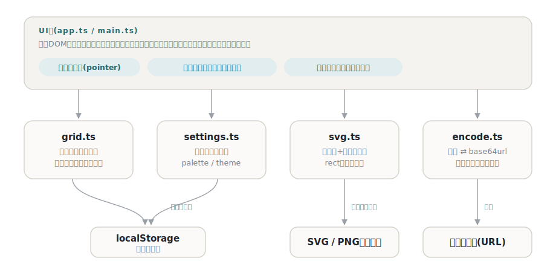

# dotten

[](https://github.com/miruky/dotten/actions/workflows/ci.yml)
[](https://github.com/miruky/dotten/actions/workflows/deploy.yml)

[](LICENSE)

**ブラウザでドット絵を描き、最適化したSVGとして書き出すピクセルアートエディタ。**

公開ページ: https://miruky.github.io/dotten/

## 概要

dottenは小さなドット絵(8×8・16×16・32×32)を描いてSVGで持ち出すためのエディタである。ペン・消しゴム・塗りつぶしの3つの道具と14色のパレット(自由な色も選べる)で描き、取り消し・やり直しで気軽に試行錯誤できる。書き出すSVGは同じ行の連続した同色マスを1つの`rect`にまとめた最適化済みの出力で、サイドパネルにそのプレビューと`rect`数が常に表示される。

描きかけの絵はブラウザのlocalStorageに保存され、サーバーには何も送らない。

### なぜ作ったのか

ファビコンやUIの小さなアイコンをドット絵で作るとき、本格的なピクセルアートツールでは大げさで、書き出しがPNGになるのも困る。スケーラブルに使い回すにはSVGがほしいが、1マス=1`rect`の素朴な変換は16×16でも最大256個の`rect`になってしまう。「すぐ描けて、軽いSVGが出てくる」の2点だけに絞った道具にした。

## アーキテクチャ



UI層はフレームワークなしのTypeScriptで、盤面のDOMは描画のたびに作り直さず、塗ったマスの背景色だけを差し替える(ドラッグ中の描画を軽くするため)。盤面の操作とSVG生成はDOMに依存しない純粋なモジュールで、そのまま単体テストできる。

## 技術スタック

| カテゴリ             | 技術                           |
| :------------------- | :----------------------------- |
| 言語                 | TypeScript 5(strict)           |
| ビルド               | Vite 6                         |
| テスト               | Vitest                         |
| リンタ・フォーマッタ | ESLint 9 / Prettier            |
| CI / 配信            | GitHub Actions / GitHub Pages  |
| 永続化               | localStorage(外部サービスなし) |

## 使い方

### 描く

道具はペン・消しゴム・塗りつぶしの3つ。マウスでもタッチでも、なぞった軌跡のマスが塗られる。塗りつぶしは同じ色の連結した領域(上下左右)をまとめて塗り替える。1ストロークが取り消しの1単位で、最大50手まで戻れる。

### 盤面の大きさ

8×8・16×16・32×32を切り替えられる。広げたときは左上を基準に既存の絵が保たれ、狭めたときは右下が切り落とされる(この操作も取り消せる)。

### SVG書き出し

「SVGを保存」または「SVGをコピー」で書き出す。出力は次の形になる。

```svg
<svg xmlns="http://www.w3.org/2000/svg" viewBox="0 0 16 16" shape-rendering="crispEdges" role="img" aria-label="dot art">
  <title>dot art</title>
  <rect x="5" y="6" width="1" height="1" fill="#7cc278"/>
  <rect x="4" y="7" width="3" height="1" fill="#7cc278"/>
</svg>
```

- 同じ行の連続した同色マスは1つの`rect`にまとめる(プレビュー下に`rect`数を表示)。
- `viewBox`は1マス=1単位。`width`/`height`を付けないので、使う側で自由な大きさに伸縮できる。
- `shape-rendering="crispEdges"`で拡大時のにじみを防ぐ。

### 制約

- 持てる絵は1枚だけ。複数の作品を切り替える機能はない。
- 行方向の連結のみ最適化し、矩形領域の統合(縦方向のマージ)はしない。
- レイヤー・アニメーション・パレットの保存には対応しない。

## プロジェクト構成

- `index.html` — エントリポイント
- `src/main.ts` — 起動。ストアの初期化と初回の見本データ投入
- `src/app.ts` — キャンバス・道具・取り消しの画面とイベント処理
- `src/icons.ts` — 線画SVGアイコン
- `src/style.css` — デザイントークンとスタイル(市松の透明表現・ライト・ダーク対応)
- `src/lib/grid.ts` — 盤面の型・塗りつぶし・大きさ変更・永続化
- `src/lib/svg.ts` — 行方向の連結をまとめたSVG書き出し
- `src/lib/seed.ts` — 初回起動時の見本のドット絵
- `docs/architecture.svg` — 構成図
- `.github/workflows/` — CI(lint・テスト・ビルド)とPagesデプロイ

## はじめ方

### 前提条件

- Node.js 22以上

### セットアップ

```bash
git clone https://github.com/miruky/dotten.git
cd dotten
npm install
npm run dev
```

### テストの実行

```bash
npm test
```

### Lintの実行

```bash
npm run lint
```

### ビルド

```bash
npm run build
```

GitHub Pagesではリポジトリ名のサブパスで配信されるため、デプロイ時は環境変数 `DOTTEN_BASE=/dotten/` でViteの `base` を切り替える(`.github/workflows/deploy.yml` 参照)。

## 設計方針

- **出力の質を機能にする** — 書き出すSVGの軽さと素性の良さ(viewBox・crispEdges・rect数)をプレビューで常に見せる。エディタの主役は編集画面ではなく出力だと考えた。
- **描き味を落とさないDOM更新** — ドラッグ中は塗ったマスのスタイルだけを書き換え、画面全体の再描画をしない。1ストローク=取り消し1単位も、この境界で確定する。
- **盤面は純粋なデータ** — 塗り・塗りつぶし・大きさ変更は配列に対する純粋な操作で、エッジケース(範囲外・同色塗りつぶし・縮小の切り落とし)をテストで固定している。
- **入力は寛容に、保存は厳密に** — 保存データの復元は大きさと色形式を検証し、壊れていれば見本から始め直す。

## ライセンス

[MIT](LICENSE)
